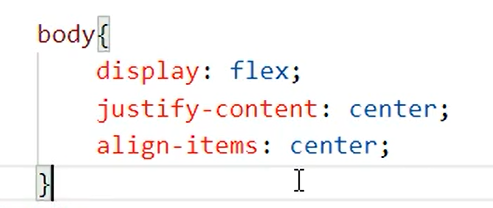
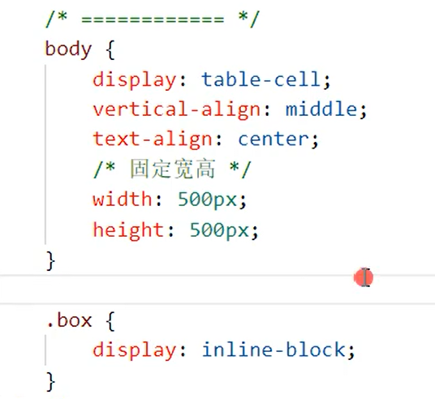
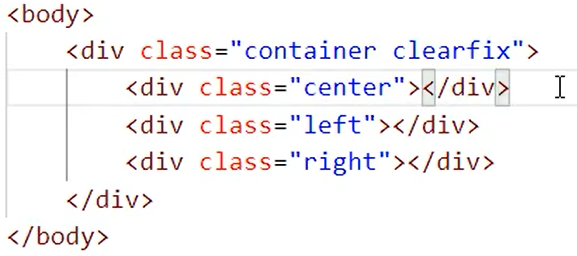
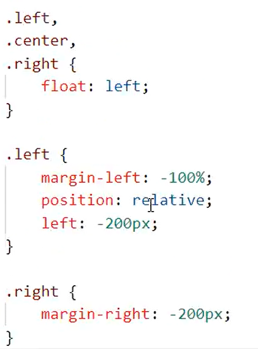
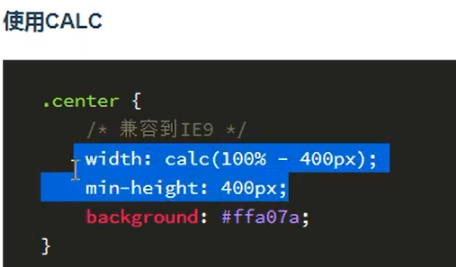
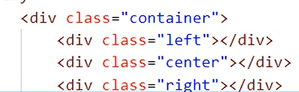
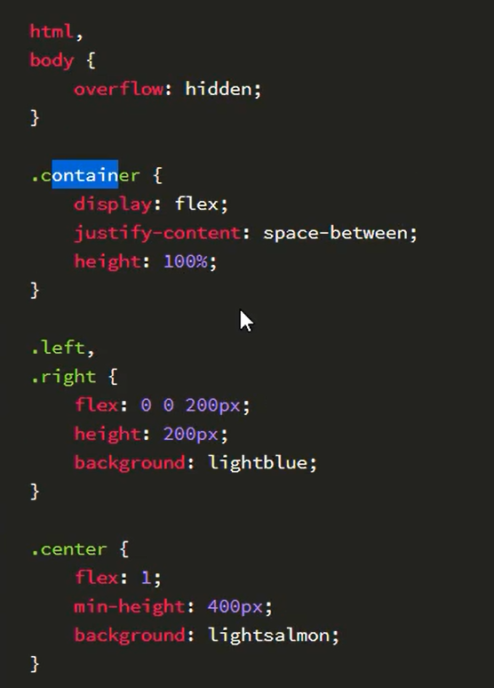

# css面试题

## 1.水平垂直居中
- 定位:三种
- display:flex
- javaScript
- display:table-cell
  
### 定位
必须知道宽高

不需要具体宽高,兼容性不好

### display:flex

### js写法

### table-cell

## 2.css 盒模型

box-sizing: content-box  标准盒模型

box-sizing: border-box  IE盒模型

flex盒模型

## 3.左右固定,中间自适应(float+负的margin)

calc:

flex

定位:

## 4.移动端响应布局开发三大方案

- media
- rem
- flex
- vh/vw
  
## 5.z-index工作原理

脱离文档流:absolute,float

## 6.谈谈对H5 的理解

## 7.如何使一个div里面的文字垂直居中,且该文字的大小根据屏幕大小自适应

## 5.下边哪个渲染性能更高

第二个:从右向左解析

