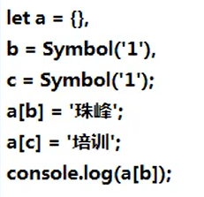
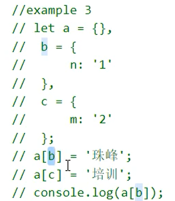

# js

## 1.对象(数组)的深克隆浅克隆

打印:培训

原因: 对象的键值可以是基本数据类型,数字与字符串是一样的键值

堆内存与栈内存

数组与object的区别

----
Symbol

自己实现一个symbol

---
对象的toString()

打印培训

Object.prototype.toString()/valueOf

----
## 2.自执行函数

输出 '4'

alert 打印的都是字符串

浏览器一执行就是形成栈内存,函数执行把函数执行的上下文压入栈

函数也是对象

闭包:闭包的作用是保存私有变量

## 3.变态题:闭包

解释:

## 4.浅拷贝

## 5.深克隆

- JSON.stringify() 函数,正则,日期会有问题

- 递归

for...in循环对象的所有枚举属性，然后再使用hasOwnProperty()方法来忽略继承属性。
